Total time spent so far: 21 hrs

# July 9 2025
Finished my other projects so I can start work on this one (lol)
- Researched parts, form factor, controller, etc.
- Decided on Supermini nrf52840 for controller
- Made initial PCB (just the keys and the layout)

Time spent: 4 hrs

# July 11 2025
- Finished layout of keys & diodes
- Connected switch matrix to controller
- Routed PCB

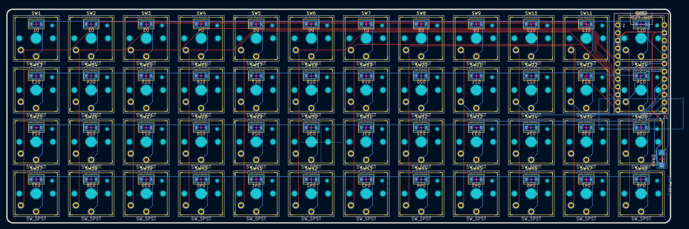

Time spent: 4 hrs

# July 13 2025
- Made ZMK firmware for the board
- Redid the PCB for 17x17 CFX spacing
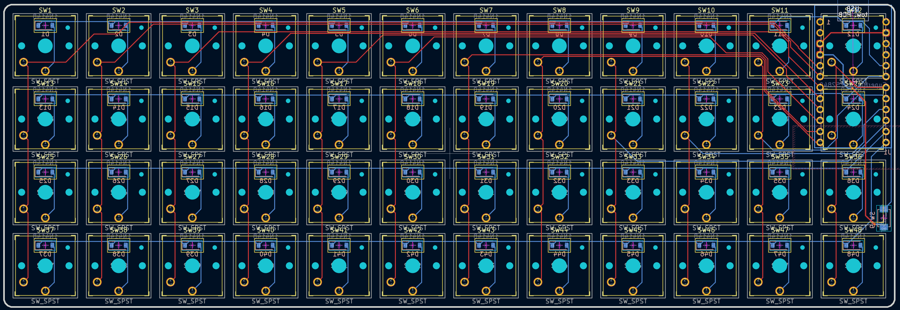

Time spent: 5 hrs

# July 15 2025
- Added mounting holes
- Made a rudimentary case
- Spent way too long researching heat-set inserts and batteries

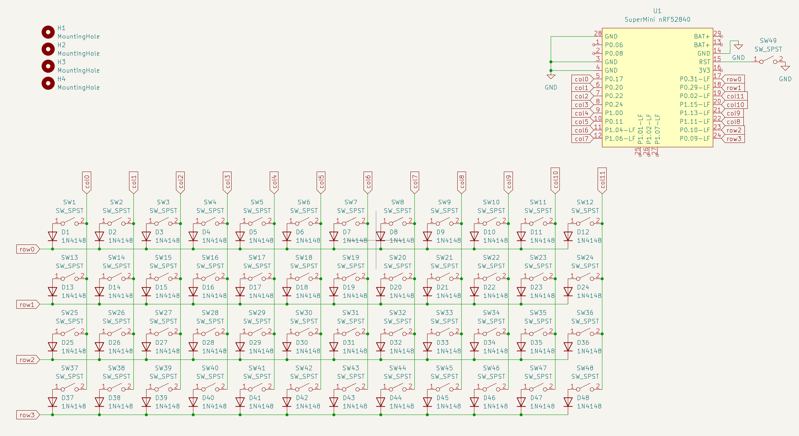
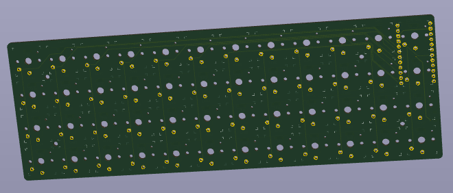
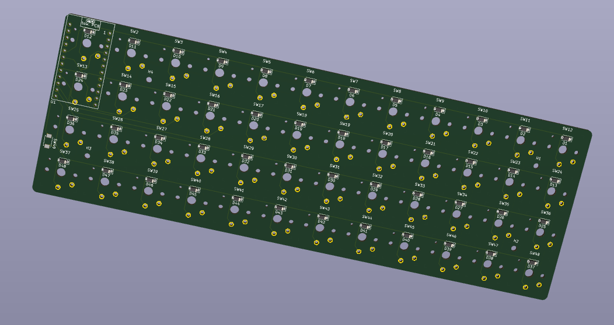
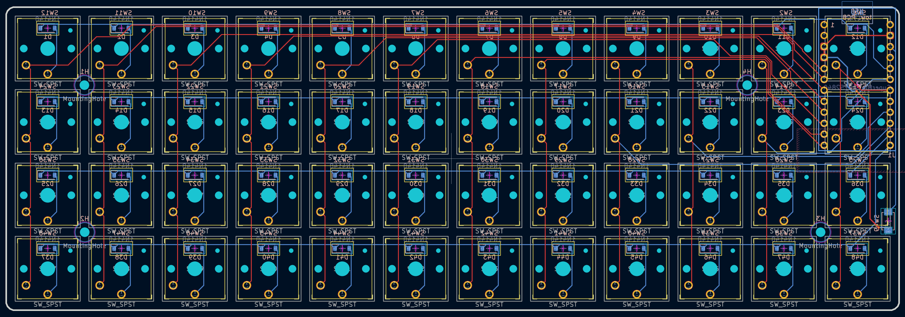
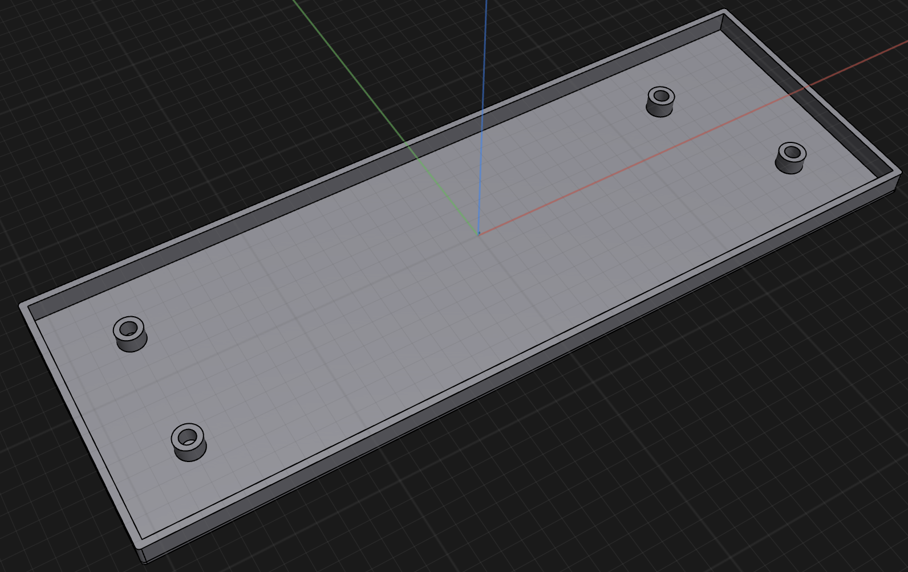
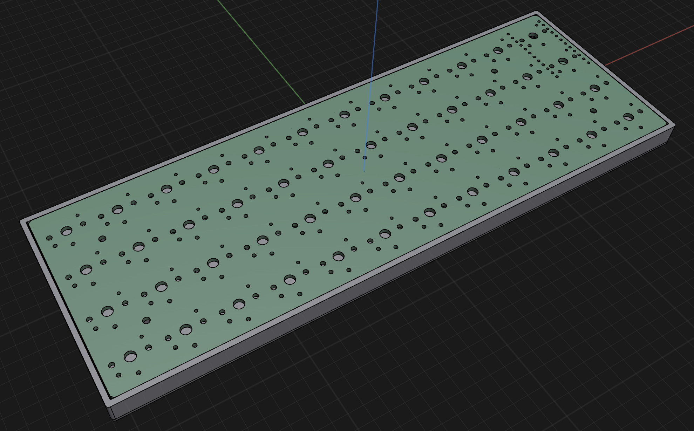

Time spent: 4 hrs

# July 16 2025
- Rendered
- Researched & BOM'ed
- Add a lil' smth to the pcb :)
- Add a hole for the USB-C port

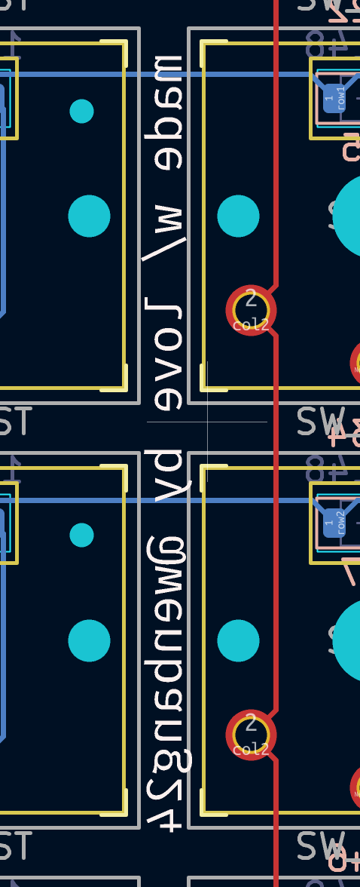
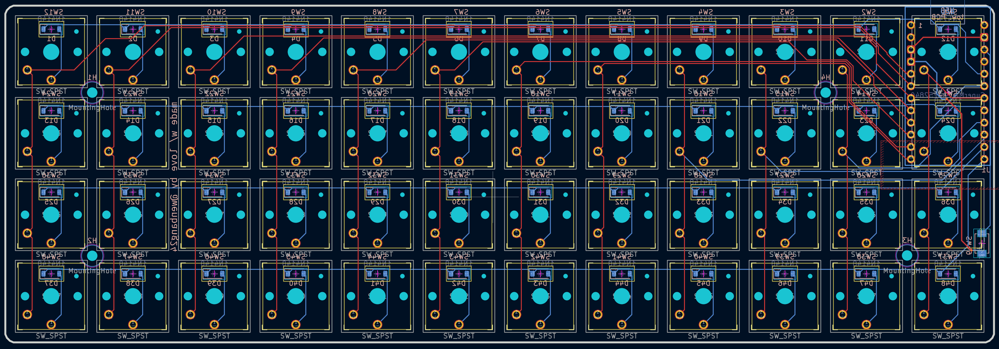
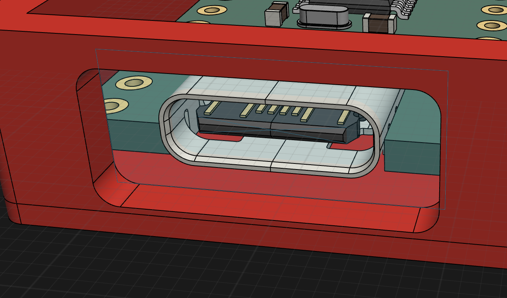

Time spent: 3 hrs

# July 26 2025
- Added prod folder
- Made some way better renders

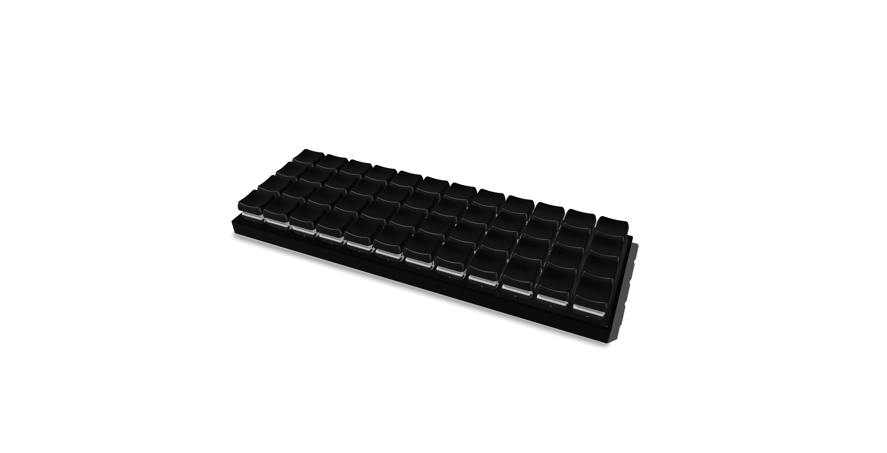

Time spent: 1 hr
