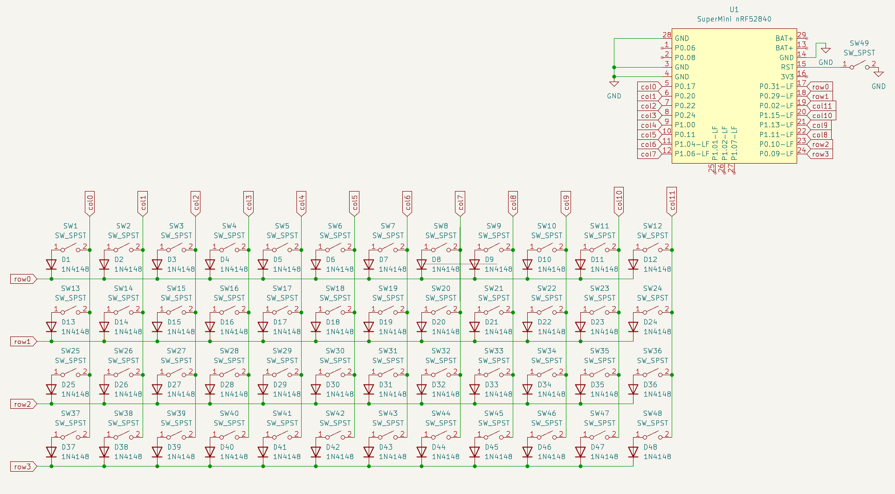

# July 9 2025
Finished my other projects so I can start work on this one (lol)
- Researched parts, form factor, controller, etc.
- Decided on Supermini nrf52840 for controller
- Made initial PCB (just the keys and the layout)

Time spent: 4 hrs

# July 11 2025
- Finished layout of keys & diodes
- Connected switch matrix to controller
- Routed PCB

Time spent: 4 hrs

# July 13 2025
- Made ZMK firmware for the board

Time spent: 2 hrs
